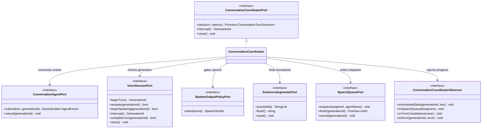

# Conversation coordinator class boundary

`ConversationCoordinator` is a Mediator. It owns orchestration while each
injected port retains one focused responsibility. Concrete HTTP, Letta, DOM,
and audio classes stay outside this module.

