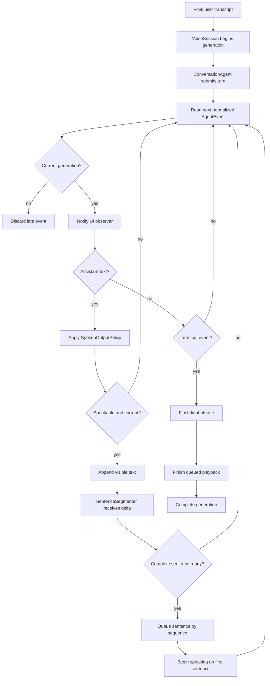

# Streaming conversation flow

The adapter normalizes the wire stream before the coordinator sees it. The
coordinator renders assistant text immediately and sends only complete,
current sentences to speech.

