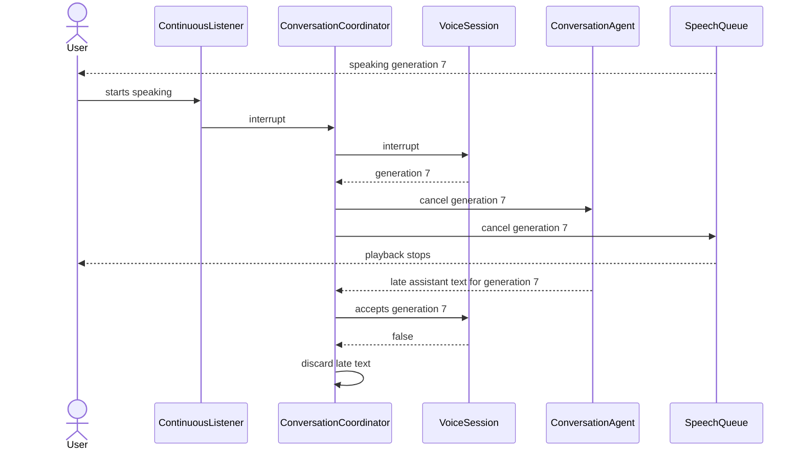

# Barge-in cancels one generation

An interruption cancels the agent stream and every prepared or playing speech
segment for that generation. The session fence rejects any late network event.

```mermaid
sequenceDiagram
  actor User
  participant Listener as ContinuousListener
  participant Coordinator as ConversationCoordinator
  participant Session as VoiceSession
  participant Agent as ConversationAgent
  participant Queue as SpeechQueue

  Queue-->>User: speaking generation 7
  User->>Listener: starts speaking
  Listener->>Coordinator: interrupt
  Coordinator->>Session: interrupt
  Session-->>Coordinator: generation 7
  Coordinator->>Agent: cancel generation 7
  Coordinator->>Queue: cancel generation 7
  Queue-->>User: playback stops
  Agent-->>Coordinator: late assistant text for generation 7
  Coordinator->>Session: accepts generation 7
  Session-->>Coordinator: false
  Coordinator->>Coordinator: discard late text
```
