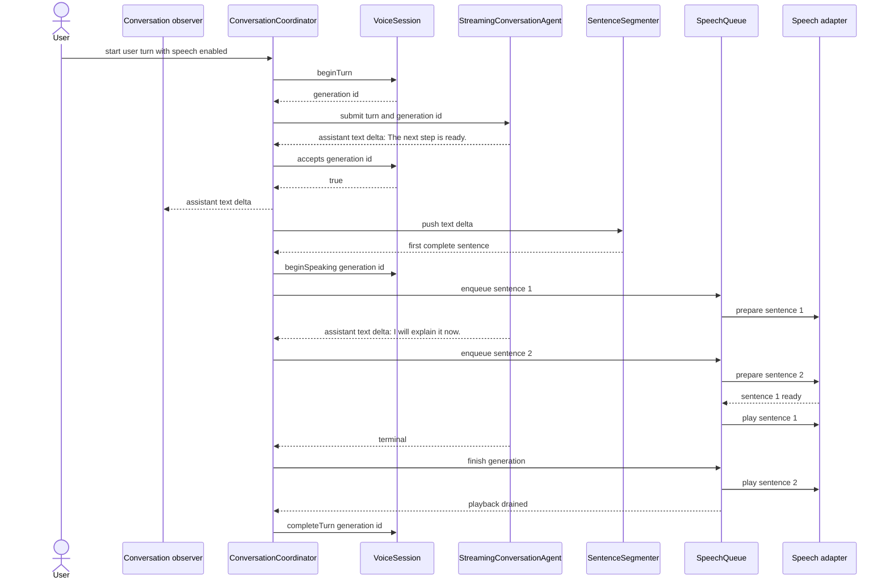

# First sentence starts before the turn finishes

The key latency improvement is that Toyota can begin speaking after the first
complete sentence. Later text generation, TTS preparation, and playback can
overlap while the queue preserves sentence order.

