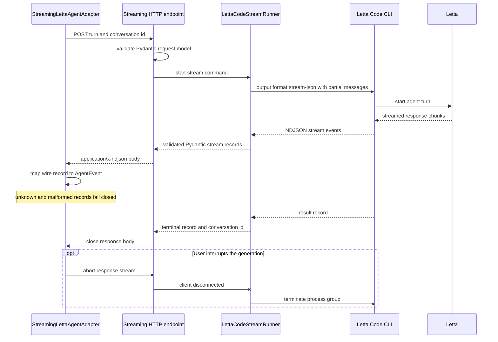

# Letta stream transport

The server adapter will expose the CLI's existing NDJSON stream rather than
waiting for the final JSON object. The browser adapter validates each line and
maps provider events to the shared `AgentEvent` vocabulary.

