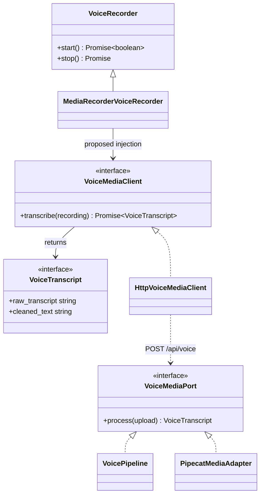

# Voice media class boundary

`VoiceMediaClient` and `HttpVoiceMediaClient` show the proposed TypeScript seam.
The recorder, wire helpers, Python port, and Whisper pipeline already exist.
The Pipecat adapter is planned and will live on the Python side.

