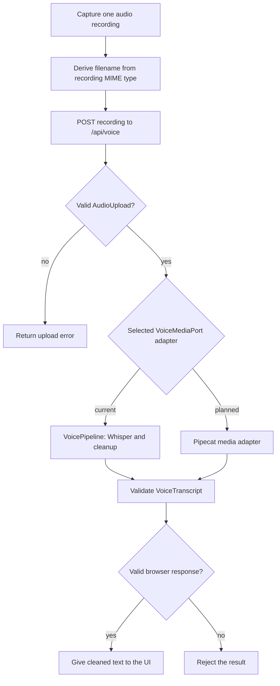

# Voice media flow

This shows the intended shared batch upload path. The Pipecat branch is planned;
the current branch uses Whisper. A separate contract will be needed for live
streaming media.

```mermaid
flowchart TD
  A["Capture one audio recording"] --> B["Derive filename from recording MIME type"]
  B --> C["POST recording to /api/voice"]
  C --> D{"Valid AudioUpload?"}
  D -->|no| E["Return upload error"]
  D -->|yes| F{"Selected VoiceMediaPort adapter"}
  F -->|current| G["VoicePipeline: Whisper and cleanup"]
  F -->|planned| H["Pipecat media adapter"]
  G --> I["Validate VoiceTranscript"]
  H --> I
  I --> J{"Valid browser response?"}
  J -->|yes| K["Give cleaned text to the UI"]
  J -->|no| L["Reject the result"]
```
