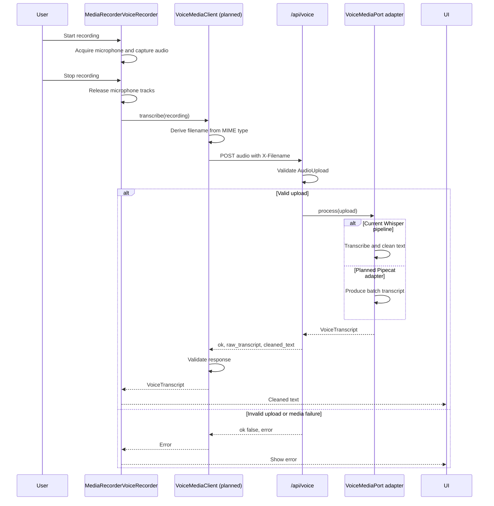

# One recording through the voice media boundary

The browser client extraction and Pipecat branch are planned. The current
`MediaRecorderVoiceRecorder` already handles the capture, upload, and response
validation steps. The server currently selects `VoicePipeline`.

