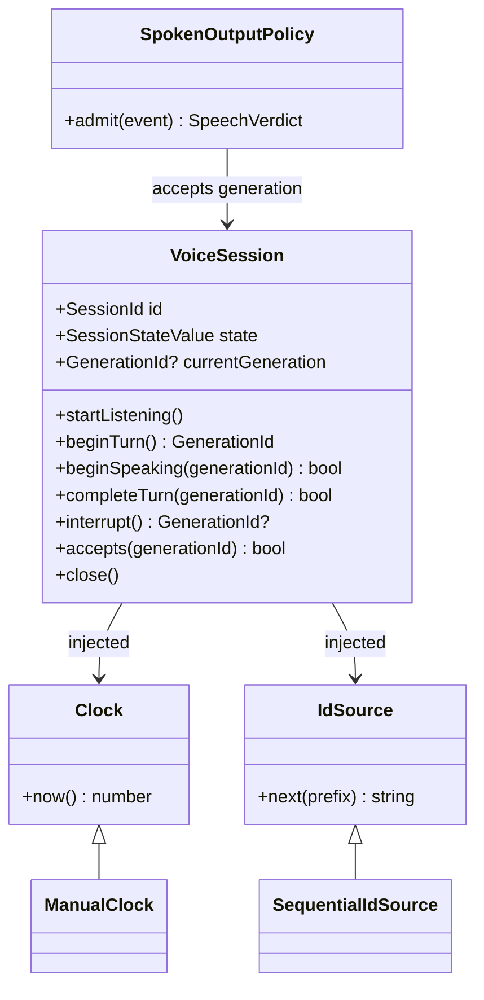

```mermaid
classDiagram
  class VoiceSession {
    +SessionId id
    +SessionStateValue state
    +GenerationId? currentGeneration
    +startListening()
    +beginTurn() GenerationId
    +beginSpeaking(generationId) bool
    +completeTurn(generationId) bool
    +interrupt() GenerationId?
    +accepts(generationId) bool
    +close()
  }
  class Clock {
    +now() number
  }
  class IdSource {
    +next(prefix) string
  }
  class ManualClock
  class SequentialIdSource
  class SpokenOutputPolicy {
    +admit(event) SpeechVerdict
  }
  Clock <|-- ManualClock
  IdSource <|-- SequentialIdSource
  VoiceSession --> Clock : injected
  VoiceSession --> IdSource : injected
  SpokenOutputPolicy --> VoiceSession : accepts generation
```
