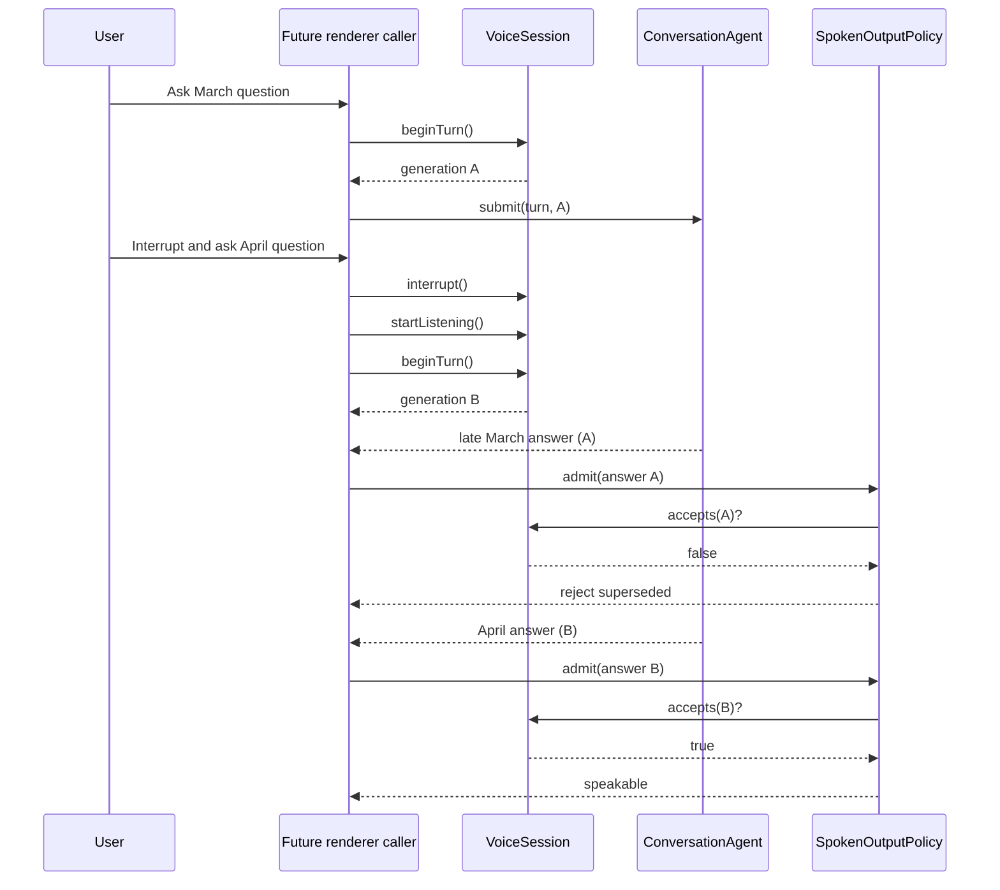

```mermaid
sequenceDiagram
  participant User
  participant UI as Future renderer caller
  participant Session as VoiceSession
  participant Agent as ConversationAgent
  participant Policy as SpokenOutputPolicy
  User->>UI: Ask March question
  UI->>Session: beginTurn()
  Session-->>UI: generation A
  UI->>Agent: submit(turn, A)
  User->>UI: Interrupt and ask April question
  UI->>Session: interrupt()
  UI->>Session: startListening()
  UI->>Session: beginTurn()
  Session-->>UI: generation B
  Agent-->>UI: late March answer (A)
  UI->>Policy: admit(answer A)
  Policy->>Session: accepts(A)?
  Session-->>Policy: false
  Policy-->>UI: reject superseded
  Agent-->>UI: April answer (B)
  UI->>Policy: admit(answer B)
  Policy->>Session: accepts(B)?
  Session-->>Policy: true
  Policy-->>UI: speakable
```
