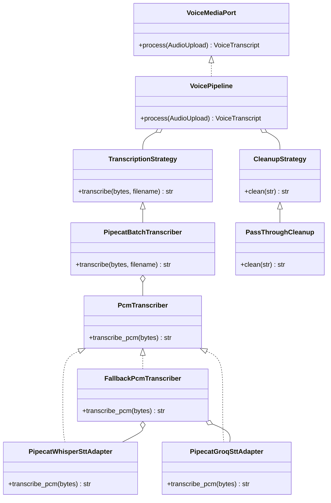

# Pipecat media classes

```mermaid
classDiagram
    class VoiceMediaPort {
        +process(AudioUpload) VoiceTranscript
    }
    class VoicePipeline {
        +process(AudioUpload) VoiceTranscript
    }
    class TranscriptionStrategy {
        +transcribe(bytes, filename) str
    }
    class PipecatBatchTranscriber {
        +transcribe(bytes, filename) str
    }
    class PcmTranscriber {
        +transcribe_pcm(bytes) str
    }
    class PipecatWhisperSttAdapter {
        +transcribe_pcm(bytes) str
    }
    class PipecatGroqSttAdapter {
        +transcribe_pcm(bytes) str
    }
    class FallbackPcmTranscriber {
        +transcribe_pcm(bytes) str
    }
    class CleanupStrategy {
        +clean(str) str
    }
    class PassThroughCleanup {
        +clean(str) str
    }
    VoiceMediaPort <|.. VoicePipeline
    TranscriptionStrategy <|-- PipecatBatchTranscriber
    PcmTranscriber <|.. PipecatWhisperSttAdapter
    PcmTranscriber <|.. PipecatGroqSttAdapter
    PcmTranscriber <|.. FallbackPcmTranscriber
    CleanupStrategy <|-- PassThroughCleanup
    VoicePipeline o-- TranscriptionStrategy
    VoicePipeline o-- CleanupStrategy
    PipecatBatchTranscriber o-- PcmTranscriber
    FallbackPcmTranscriber o-- PipecatGroqSttAdapter
    FallbackPcmTranscriber o-- PipecatWhisperSttAdapter
```
