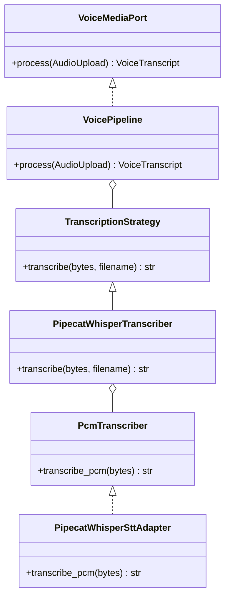

# Pipecat media classes

```mermaid
classDiagram
    class VoiceMediaPort {
        +process(AudioUpload) VoiceTranscript
    }
    class VoicePipeline {
        +process(AudioUpload) VoiceTranscript
    }
    class TranscriptionStrategy {
        +transcribe(bytes, filename) str
    }
    class PipecatWhisperTranscriber {
        +transcribe(bytes, filename) str
    }
    class PcmTranscriber {
        +transcribe_pcm(bytes) str
    }
    class PipecatWhisperSttAdapter {
        +transcribe_pcm(bytes) str
    }
    VoiceMediaPort <|.. VoicePipeline
    TranscriptionStrategy <|-- PipecatWhisperTranscriber
    PcmTranscriber <|.. PipecatWhisperSttAdapter
    VoicePipeline o-- TranscriptionStrategy
    PipecatWhisperTranscriber o-- PcmTranscriber
```
