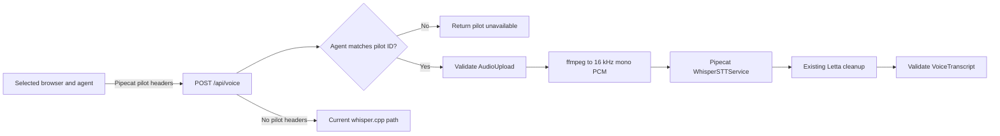

# Pipecat pilot flow

```mermaid
flowchart LR
    Browser[Selected browser and agent] -->|Pipecat pilot headers| Route[POST /api/voice]
    Route --> Gate{Agent matches pilot ID?}
    Gate -->|No| Reject[Return pilot unavailable]
    Gate -->|Yes| Upload[Validate AudioUpload]
    Upload --> Decode[ffmpeg to 16 kHz mono PCM]
    Decode --> STT[Pipecat WhisperSTTService]
    STT --> Cleanup[Existing Letta cleanup]
    Cleanup --> Response[Validate VoiceTranscript]
    Route -->|No pilot headers| Current[Current whisper.cpp path]
```
