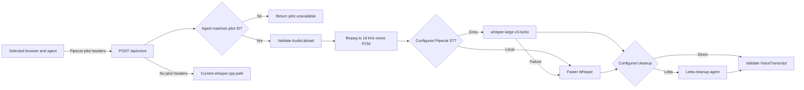

# Pipecat pilot flow

```mermaid
flowchart LR
    Browser[Selected browser and agent] -->|Pipecat pilot headers| Route[POST /api/voice]
    Route --> Gate{Agent matches pilot ID?}
    Gate -->|No| Reject[Return pilot unavailable]
    Gate -->|Yes| Upload[Validate AudioUpload]
    Upload --> Decode[ffmpeg to 16 kHz mono PCM]
    Decode --> STT{Configured Pipecat STT}
    STT -->|Groq| Groq[whisper-large-v3-turbo]
    STT -->|Local| Local[Faster Whisper]
    Groq -->|Failure| Local
    Groq --> Cleanup{Configured cleanup}
    Local --> Cleanup
    Cleanup -->|Direct| Response[Validate VoiceTranscript]
    Cleanup -->|Letta| Agent[Letta cleanup agent]
    Agent --> Response
    Route -->|No pilot headers| Current[Current whisper.cpp path]
```
