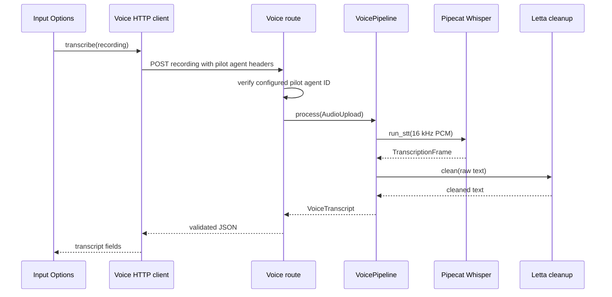

# Pipecat pilot upload sequence

```mermaid
sequenceDiagram
    participant UI as Input Options
    participant HTTP as Voice HTTP client
    participant Route as Voice route
    participant Media as VoicePipeline
    participant STT as Pipecat Whisper
    participant Cleanup as Letta cleanup
    UI->>HTTP: transcribe(recording)
    HTTP->>Route: POST recording with pilot agent headers
    Route->>Route: verify configured pilot agent ID
    Route->>Media: process(AudioUpload)
    Media->>STT: run_stt(16 kHz PCM)
    STT-->>Media: TranscriptionFrame
    Media->>Cleanup: clean(raw text)
    Cleanup-->>Media: cleaned text
    Media-->>Route: VoiceTranscript
    Route-->>HTTP: validated JSON
    HTTP-->>UI: transcript fields
```
