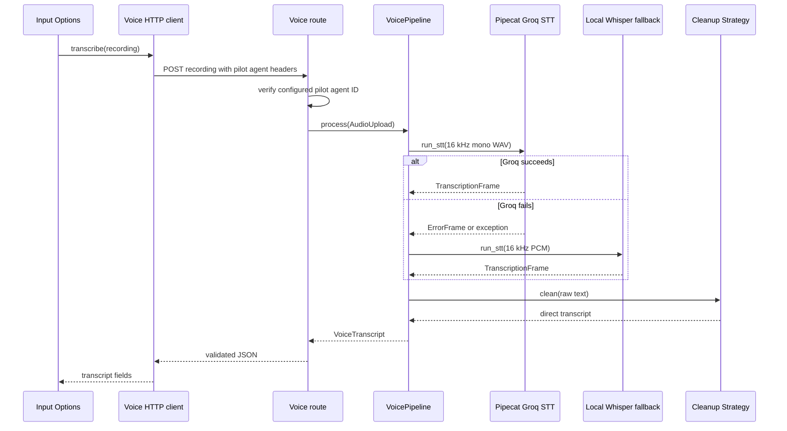

# Pipecat pilot upload sequence

```mermaid
sequenceDiagram
    participant UI as Input Options
    participant HTTP as Voice HTTP client
    participant Route as Voice route
    participant Media as VoicePipeline
    participant Groq as Pipecat Groq STT
    participant Local as Local Whisper fallback
    participant Cleanup as Cleanup Strategy
    UI->>HTTP: transcribe(recording)
    HTTP->>Route: POST recording with pilot agent headers
    Route->>Route: verify configured pilot agent ID
    Route->>Media: process(AudioUpload)
    Media->>Groq: run_stt(16 kHz mono WAV)
    alt Groq succeeds
        Groq-->>Media: TranscriptionFrame
    else Groq fails
        Groq-->>Media: ErrorFrame or exception
        Media->>Local: run_stt(16 kHz PCM)
        Local-->>Media: TranscriptionFrame
    end
    Media->>Cleanup: clean(raw text)
    Cleanup-->>Media: direct transcript
    Media-->>Route: VoiceTranscript
    Route-->>HTTP: validated JSON
    HTTP-->>UI: transcript fields
```
