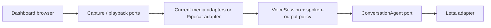

# The Sunday Plan

## Decision — 2026-09-20

EG chose the existing dashboard voice stack as the production foundation. Add
Pipecat incrementally where real-time media, turn detection, or interruption
needs it. Keep the dashboard's browser and agent workflows in place while each
Pipecat adapter proves the same application contract. Do not build a parallel
voice application or duplicate Letta memory, tools, routing, or speech policy.

The earlier dashboard-versus-Pipecat decision gate is closed. The old
`notes_plans_handoffs/pipecat_letta_voice_plan.html` describes the original
standalone prototype and is superseded by this integration direction.

## Verified baseline in this checkout

- `dashboard/docs/voice.md` documents the live push-to-talk path:
  `MediaRecorder → /api/voice → whisper.cpp → cleanup → message box`, plus
  browser continuous listening and server-side edge-tts replies.
- `dashboard/voice/transcription.py` and `synthesis.py` already define Python
  Strategy ABCs. `dashboard/voice/pipeline.py` composes the existing upload path.
- `dashboard/js/abstract/voice-recorder.interface.js` and
  `speech-synthesizer.interface.js` define the browser capture and output seams.
- `VoiceSession`, `ConversationAgent`, `LettaAgentAdapter`, and
  `SpokenOutputPolicy` exist under `dashboard/js/` with tests. Input Options
  uses all four through its boot composition roots, with a session per agent
  retained across renderer rebuilds.
- This checkout's `voice_communication/` directory currently contains only
  this plan. Earlier references to `voice_communication/ts/`, `py/`,
  `contracts/`, `CLAUDE.md`, `build_plan.md`, and `recent_activity.md` are not
  present here. Do not claim those tests or modules exist on this machine.

## Architecture rule

Application policy depends on ports; adapters own browser APIs, Letta HTTP,
Whisper, edge-tts, and eventually Pipecat. Construct concrete adapters at a
composition root. Use Strategy for interchangeable speech engines, Adapter for
Pipecat frames and Letta events, State for session lifecycle, and Observer only
where a real UI or health consumer needs events. Do not add a pattern without a
specific boundary it improves.

- Python: ABC or `Protocol` for behavior; Pydantic models at untrusted HTTP,
  process, or Pipecat event boundaries. Keep schemas separate from policy
  objects and validate before the data crosses into them.
- Browser: keep the existing vanilla JS callers and injected collaborators.
  New module work starts in TypeScript: `dashboard/js/abstract/voice_session/`
  is the first module, with typed source, a module-local `tsconfig.json`, and
  checked-in browser JS output. Keep runtime validation at HTTP and media
  boundaries; TypeScript interfaces alone do not validate external data.
- One agent-turn contract must decide conversation identity, event filtering,
  one active turn, interruption, and stale-output suppression for both media
  paths. Only assistant-facing text may reach speech output.

## Delivery order

1. **Adopt the existing agent port — done.** `InputOptionsRenderer` receives
   `LettaAgentAdapter` from its boot modules; its duplicate direct request and
   conversation bookkeeping are gone. Renderer tests use the fake adapter.
2. **Make interruption safe in the live UI — Input Options done.** Input Options
   receives `VoiceSession` and `SpokenOutputPolicy`, so a superseded reply is
   silent. The session owns a cancellable playback handle and remains speaking
   until audio ends. Navigation, a new Send, push-to-talk, and Toyota's
   continuous listener interrupt playback. Next adopt the same session and
   speech policy in the other renderer send paths.
3. **Characterize the media boundary.** Record the current `/api/voice` request
   and response contract, browser microphone lifecycle, audio format, and
   speech-output behavior in tests. Define the smallest Python media port and
   Pydantic wire models needed by a second implementation.
4. **Add one Pipecat adapter.** Verify current Pipecat APIs and select a pinned
   version before coding. Start with one dashboard user and one existing Letta
   agent. Connect Pipecat at the media port; keep agent-turn policy and Letta
   ownership in the existing application layer. Select the adapter at the
   composition root and retain the current path while evaluating it.
5. **Prove parity before expanding.** Test microphone → transcript → agent →
   speech, interruption during each stage, stale events, reconnect, errors,
   and whether tool/internal events remain silent. Compare latency and recovery
   with the current dashboard path before adding more agents or transports.

## Immediate next slice

Continue step 2: adopt the session and speech policy in ChatDetailRenderer and
AgentsRouterRenderer, then characterize the media boundary.

## Working rules

- Read `dashboard/CLAUDE.md`, `dashboard/docs/voice.md`, and the Voice
  Communication workspace before editing the live voice path.
- Keep each port's contract tests shared across current and Pipecat adapters.
- Keep SDK, process, HTTP, and DOM imports inside adapters.
- Run `bun test dashboard/js/tests` for browser changes and
  `dashboard/.venv/bin/python -m pytest dashboard/tests/` for Python changes;
  use focused files while developing.
- Record each completed slice and its verification here. Deployment of any
  dashboard code change follows `dashboard/CLAUDE.md`.

## Decision log

| Date | Decision | Made by |
|---|---|---|
| 2026-09-20 | Use the working dashboard stack and integrate Pipecat incrementally through interfaces. | EG |

## Session handoff — 2026-09-20

- Completed: recorded the runtime decision and reconciled this plan with the
  files present in the current checkout. Committed and pushed that checkpoint
  as `2937e690` before writing a failing test. Added a failing renderer test,
  then adopted the conversation port in Input Options and updated the live
  architecture guide.
- Tests run: the new test failed before the change and passed afterward;
  `bun test dashboard/js/tests` passed (2546 pass, 2 skip), and the Project
  Plans Python tests passed (17 pass). `bun run typecheck` passed, and all 14
  Voice Communication workspace specs validated. A real agent send was not
  used.
- Next smallest task: adopt `VoiceSession` and `SpokenOutputPolicy` in Input
  Options, starting with a late-reply renderer test.

## Module setup — 2026-09-20

EG requested one directory per module and TypeScript for new module work.
`dashboard/js/abstract/voice_session/` now owns the typed lifecycle and its
clock/id ports, diagrams, `tsconfig.json`, and compiled browser modules.
The original JavaScript paths are compatibility re-exports. This organizes
the session contract. Input Options now adopts the session and spoken-output
policy through its boot modules.
Verification: module TypeScript compilation, 28 focused session/policy tests,
the dashboard JS suite (2546 pass, 2 skip), 17 Project Plans tests, and the
repo typecheck passed. The compiled module is served at its dashboard URL.

## Input Options green phase — 2026-09-20

- The renderer's late-reply tests failed before the change because Send spoke
  the response directly. Both pass after Send takes a generation id from the
  injected session and asks the policy before speaking.
- `agent-detail-renderers.js` retains one session per agent across renderer
  rebuilds. Agent navigation interrupts active Input Options turns. Toyota's
  home box gets its own session at its composition root.
- A renderer-rebuild test proves that a slow first reply stays silent after a
  second send, while the current answer is spoken. The same test first failed
  because the old reply overwrote the newer conversation id; sharing and
  cancelling the agent adapter fixes that race. Active playback interruption
  remains the next behavior slice.

## Active playback green phase — 2026-09-20

- Red tests showed that `InputOptionsRenderer` completed a turn when
  `audio.play()` started and `EdgeTtsSpeechSynthesizer` returned no cancellable
  utterance handle. The session could therefore reject late text but could not
  stop audio already playing.
- `VoiceSession` now owns one `SpeechPlayback` handle per speaking turn. The
  edge-tts token exposes `pending`, `finished`, and utterance-scoped `cancel`;
  the renderer completes the turn after `finished`. Interrupt, close, a new
  Send, and navigation cancel the active handle. Toyota's push-to-talk and
  recognized speech interrupt a current turn.
- Focused tests cover audio end, interruption, close, a second send, navigation,
  cancellation during fetch, stale token isolation, blocked playback, and
  empty recognition text. The dashboard JS suite passed (2564 pass, 2 skip),
  and the repository typecheck passed. Browser assets returned HTTP 200 from
  the live checkout. A real microphone or agent send was not used.
