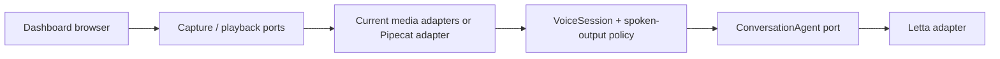

# The Sunday Plan

## Decision — 2026-09-20

EG chose the existing dashboard voice stack as the production foundation. Add
Pipecat incrementally where real-time media, turn detection, or interruption
needs it. Keep the dashboard's browser and agent workflows in place while each
Pipecat adapter proves the same application contract. Do not build a parallel
voice application or duplicate Letta memory, tools, routing, or speech policy.

The earlier dashboard-versus-Pipecat decision gate is closed. The old
`notes_plans_handoffs/pipecat_letta_voice_plan.html` describes the original
standalone prototype and is superseded by this integration direction.

## Verified baseline in this checkout

- `dashboard/docs/voice.md` documents the live push-to-talk path:
  `MediaRecorder → /api/voice → whisper.cpp → cleanup → message box`, plus
  browser continuous listening and server-side edge-tts replies.
- `dashboard/voice/transcription.py` and `synthesis.py` already define Python
  Strategy ABCs. `dashboard/voice/pipeline.py` composes the existing upload path.
- `dashboard/js/abstract/voice-recorder.interface.js` and
  `speech-synthesizer.interface.js` define the browser capture and output seams.
- `VoiceSession`, `ConversationAgent`, `LettaAgentAdapter`, and
  `SpokenOutputPolicy` exist under `dashboard/js/` with tests. The live renderers
  have not adopted them yet; the dashboard's Voice Communication workspace
  lists the adoption order.
- This checkout's `voice_communication/` directory currently contains only
  this plan. Earlier references to `voice_communication/ts/`, `py/`,
  `contracts/`, `CLAUDE.md`, `build_plan.md`, and `recent_activity.md` are not
  present here. Do not claim those tests or modules exist on this machine.

## Architecture rule

Application policy depends on ports; adapters own browser APIs, Letta HTTP,
Whisper, edge-tts, and eventually Pipecat. Construct concrete adapters at a
composition root. Use Strategy for interchangeable speech engines, Adapter for
Pipecat frames and Letta events, State for session lifecycle, and Observer only
where a real UI or health consumer needs events. Do not add a pattern without a
specific boundary it improves.

- Python: ABC or `Protocol` for behavior; Pydantic models at untrusted HTTP,
  process, or Pipecat event boundaries. Keep schemas separate from policy
  objects and validate before the data crosses into them.
- Browser: preserve the dashboard's existing vanilla JS interface modules and
  injected collaborators. Use TypeScript `interface` and runtime validation if
  a new typed TypeScript package is introduced; a compile-time type alone does
  not validate HTTP or media-service data. Do not convert working dashboard JS
  solely to claim TypeScript coverage.
- One agent-turn contract must decide conversation identity, event filtering,
  one active turn, interruption, and stale-output suppression for both media
  paths. Only assistant-facing text may reach speech output.

## Delivery order

1. **Adopt the existing agent port.** Inject `LettaAgentAdapter` into
   `InputOptionsRenderer`; remove its duplicate direct request and conversation
   bookkeeping. Use the shared fake adapter in renderer tests.
2. **Make interruption safe in the live UI.** Give the renderer a `VoiceSession`
   and `SpokenOutputPolicy`. A superseded reply must never be spoken. Then wire
   speech-start interruption and repeat the adoption for the other renderers.
3. **Characterize the media boundary.** Record the current `/api/voice` request
   and response contract, browser microphone lifecycle, audio format, and
   speech-output behavior in tests. Define the smallest Python media port and
   Pydantic wire models needed by a second implementation.
4. **Add one Pipecat adapter.** Verify current Pipecat APIs and select a pinned
   version before coding. Start with one dashboard user and one existing Letta
   agent. Connect Pipecat at the media port; keep agent-turn policy and Letta
   ownership in the existing application layer. Select the adapter at the
   composition root and retain the current path while evaluating it.
5. **Prove parity before expanding.** Test microphone → transcript → agent →
   speech, interruption during each stage, stale events, reconnect, errors,
   and whether tool/internal events remain silent. Compare latency and recovery
   with the current dashboard path before adding more agents or transports.

## Immediate next slice

Implement step 1 in `dashboard/js/implementation/detail-renderers.js` and its
boot wiring, following the existing Voice Communication workspace's specific
adoption notes. This is the smallest live change that proves the agent port
works before Pipecat is attached to the media side.

## Working rules

- Read `dashboard/CLAUDE.md`, `dashboard/docs/voice.md`, and the Voice
  Communication workspace before editing the live voice path.
- Keep each port's contract tests shared across current and Pipecat adapters.
- Keep SDK, process, HTTP, and DOM imports inside adapters.
- Run `bun test dashboard/js/tests` for browser changes and
  `dashboard/.venv/bin/python -m pytest dashboard/tests/` for Python changes;
  use focused files while developing.
- Record each completed slice and its verification here. Deployment of any
  dashboard code change follows `dashboard/CLAUDE.md`.

## Decision log

| Date | Decision | Made by |
|---|---|---|
| 2026-09-20 | Use the working dashboard stack and integrate Pipecat incrementally through interfaces. | EG |

## Session handoff — 2026-09-20

- Completed: recorded the runtime decision and reconciled this plan with the
  files present in the current checkout.
- Tests run: documentation validation only.
- Next smallest task: adopt `LettaAgentAdapter` in `InputOptionsRenderer` with
  a fake-adapter renderer test, then verify the live dashboard path.
