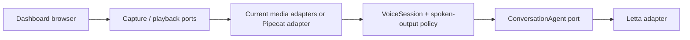

# The Sunday Plan

## Decision — 2026-09-20

EG chose the existing dashboard voice stack as the production foundation. Add
Pipecat incrementally where real-time media, turn detection, or interruption
needs it. Keep the dashboard's browser and agent workflows in place while each
Pipecat adapter proves the same application contract. Do not build a parallel
voice application or duplicate Letta memory, tools, routing, or speech policy.

The earlier dashboard-versus-Pipecat decision gate is closed. The old
`notes_plans_handoffs/pipecat_letta_voice_plan.html` describes the original
standalone prototype and is superseded by this integration direction.

## Verified baseline in this checkout

- `dashboard/docs/voice.md` documents the live push-to-talk path:
  `MediaRecorder → /api/voice → whisper.cpp → cleanup → message box`, plus
  browser continuous listening and server-side edge-tts replies.
- `dashboard/voice/transcription.py` and `synthesis.py` already define Python
  Strategy ABCs. `dashboard/voice/pipeline.py` composes the existing upload path.
- `dashboard/js/abstract/voice-recorder.interface.js` and
  `speech-synthesizer.interface.js` define the browser capture and output seams.
- `VoiceSession`, `ConversationAgent`, `LettaAgentAdapter`, and
  `SpokenOutputPolicy` exist under `dashboard/js/` with tests. Input Options
  uses all four through its boot composition roots. Chat uses a typed
  `TestChatAgentAdapter` for its distinct `/api/test` reply shape. Each path
  retains a session per agent across renderer rebuilds.
- This checkout's `voice_communication/` directory currently contains only
  this plan. Earlier references to `voice_communication/ts/`, `py/`,
  `contracts/`, `CLAUDE.md`, `build_plan.md`, and `recent_activity.md` are not
  present here. Do not claim those tests or modules exist on this machine.

## Architecture rule

Application policy depends on ports; adapters own browser APIs, Letta HTTP,
Whisper, edge-tts, and eventually Pipecat. Construct concrete adapters at a
composition root. Use Strategy for interchangeable speech engines, Adapter for
Pipecat frames and Letta events, State for session lifecycle, and Observer only
where a real UI or health consumer needs events. Do not add a pattern without a
specific boundary it improves.

- Python: ABC or `Protocol` for behavior; Pydantic models at untrusted HTTP,
  process, or Pipecat event boundaries. Keep schemas separate from policy
  objects and validate before the data crosses into them.
- Browser: keep the existing vanilla JS callers and injected collaborators.
  New module work starts in TypeScript: `dashboard/js/abstract/voice_session/`
  is the first module, with typed source, a module-local `tsconfig.json`, and
  checked-in browser JS output. Keep runtime validation at HTTP and media
  boundaries; TypeScript interfaces alone do not validate external data.
- One agent-turn contract must decide conversation identity, event filtering,
  one active turn, interruption, and stale-output suppression for both media
  paths. Only assistant-facing text may reach speech output.

## Delivery order

1. **Adopt the existing agent port — done.** `InputOptionsRenderer` receives
   `LettaAgentAdapter` from its boot modules; its duplicate direct request and
   conversation bookkeeping are gone. Renderer tests use the fake adapter.
2. **Make interruption safe in the live UI — done for both reply paths.**
   Input Options and Chat receive `VoiceSession` and `SpokenOutputPolicy`, so
   superseded replies stay silent. A session owns cancellable playback until
   audio ends. Navigation, a new Send, and push-to-talk interrupt playback;
   Toyota's continuous listener interrupts its Input Options turn. The
   Agents-home router classifies and hands text to Input Options; it does not
   produce an agent reply or speech output.
3. **Characterize the media boundary — done.** Record the current `/api/voice` request
   and response contract, browser microphone lifecycle, audio format, and
   speech-output behavior in tests. Define the smallest Python media port and
   Pydantic wire models needed by a second implementation.
4. **Add one Pipecat adapter — batch pilot implemented.** Pipecat 1.11.0 is
   pinned in `dashboard/requirements-pipecat.txt`. One browser and one existing
   Letta agent can opt in through matched browser/server agent IDs. Pipecat's
   local Whisper service feeds the existing `VoicePipeline` media port and
   cleanup; the default remains whisper.cpp. Real browser/agent parity is
   still the next step.
5. **Prove parity before expanding.** Test microphone → transcript → agent →
   speech, interruption during each stage, stale events, reconnect, errors,
   and whether tool/internal events remain silent. Compare latency and recovery
   with the current dashboard path before adding more agents or transports.

## Immediate next slice

Begin step 5: enable the one-agent pilot, compare real microphone → transcript
→ Letta agent → speech behavior with the current path, and measure latency and
recovery. The port still handles a complete recording per request; streaming
media needs a separate, explicit contract.

## Working rules

- Read `dashboard/CLAUDE.md`, `dashboard/docs/voice.md`, and the Voice
  Communication workspace before editing the live voice path.
- Keep each port's contract tests shared across current and Pipecat adapters.
- Keep SDK, process, HTTP, and DOM imports inside adapters.
- Run `bun test dashboard/js/tests` for browser changes and
  `dashboard/.venv/bin/python -m pytest dashboard/tests/` for Python changes;
  use focused files while developing.
- Record each completed slice and its verification here. Deployment of any
  dashboard code change follows `dashboard/CLAUDE.md`.

## Decision log

| Date | Decision | Made by |
|---|---|---|
| 2026-09-20 | Use the working dashboard stack and integrate Pipecat incrementally through interfaces. | EG |

## Session handoff — 2026-09-20

- Completed: recorded the runtime decision and reconciled this plan with the
  files present in the current checkout. Committed and pushed that checkpoint
  as `2937e690` before writing a failing test. Added a failing renderer test,
  then adopted the conversation port in Input Options and updated the live
  architecture guide.
- Tests run: the new test failed before the change and passed afterward;
  `bun test dashboard/js/tests` passed (2546 pass, 2 skip), and the Project
  Plans Python tests passed (17 pass). `bun run typecheck` passed, and all 14
  Voice Communication workspace specs validated. A real agent send was not
  used.
- Next smallest task: adopt `VoiceSession` and `SpokenOutputPolicy` in Input
  Options, starting with a late-reply renderer test.

## Module setup — 2026-09-20

EG requested one directory per module and TypeScript for new module work.
`dashboard/js/abstract/voice_session/` now owns the typed lifecycle and its
clock/id ports, diagrams, `tsconfig.json`, and compiled browser modules.
The original JavaScript paths are compatibility re-exports. This organizes
the session contract. Input Options now adopts the session and spoken-output
policy through its boot modules.
Verification: module TypeScript compilation, 28 focused session/policy tests,
the dashboard JS suite (2546 pass, 2 skip), 17 Project Plans tests, and the
repo typecheck passed. The compiled module is served at its dashboard URL.

## Input Options green phase — 2026-09-20

- The renderer's late-reply tests failed before the change because Send spoke
  the response directly. Both pass after Send takes a generation id from the
  injected session and asks the policy before speaking.
- `agent-detail-renderers.js` retains one session per agent across renderer
  rebuilds. Agent navigation interrupts active Input Options turns. Toyota's
  home box gets its own session at its composition root.
- A renderer-rebuild test proves that a slow first reply stays silent after a
  second send, while the current answer is spoken. The same test first failed
  because the old reply overwrote the newer conversation id; sharing and
  cancelling the agent adapter fixes that race. Active playback interruption
  remains the next behavior slice.

## Active playback green phase — 2026-09-20

- Red tests showed that `InputOptionsRenderer` completed a turn when
  `audio.play()` started and `EdgeTtsSpeechSynthesizer` returned no cancellable
  utterance handle. The session could therefore reject late text but could not
  stop audio already playing.
- `VoiceSession` now owns one `SpeechPlayback` handle per speaking turn. The
  edge-tts token exposes `pending`, `finished`, and utterance-scoped `cancel`;
  the renderer completes the turn after `finished`. Interrupt, close, a new
  Send, and navigation cancel the active handle. Toyota's push-to-talk and
  recognized speech interrupt a current turn.
- Focused tests cover audio end, interruption, close, a second send, navigation,
  cancellation during fetch, stale token isolation, blocked playback, and
  empty recognition text. The dashboard JS suite passed (2564 pass, 2 skip),
  and the repository typecheck passed. Browser assets returned HTTP 200 from
  the live checkout. A real microphone or agent send was not used.

## Chat adoption green phase — 2026-09-20

- Failing renderer tests showed Chat still bypassed the conversation port and
  could speak a reasoning-only or tool-only `/api/test` reply. Chat now sends
  through a typed `TestChatAgentAdapter`, while preserving that endpoint's
  message-reset behavior. The adapter validates reply rows and passes the
  shared `ConversationAgent` contract suite.
- Chat now holds per-agent session state across renderer rebuilds, rejects late
  replies, and retains a cancellable playback handle until audio ends. Its
  Speak toggle, a new Send, push-to-talk, and agent navigation stop active
  playback. The old `composeSpokenText` fallback was removed.
- Inspection corrected an earlier plan assumption: `AgentsRouterRenderer`
  calls `/api/route-detect` and hands text to Input Options; it does not call
  `/api/letta-code-message` or speak an agent response. No speech policy belongs
  in that renderer. Its capture path is part of the next media-boundary slice.
- The dashboard JavaScript suite passed (2582 pass, 2 skip), both typed modules
  compiled, repository typecheck passed, and the live dashboard served the new
  adapter (HTTP 200). No real microphone or agent send was used.

## Media boundary green phase — 2026-09-20

- Red tests captured the fixed `voice.webm` upload label for MP4 recordings,
  an unvalidated success response, and microphone streams left open after
  recorder failures. `voice/media/` now owns Pydantic upload/transcript shapes
  and the batch `VoiceMediaPort`; the existing Whisper pipeline implements it.
  The browser's new TypeScript `voice_media` module derives `X-Filename` from
  the recording MIME type and validates `/api/voice` JSON at runtime.
- `/api/voice` still receives raw audio bytes and returns HTTP 200 JSON with
  `{ok, raw_transcript, cleaned_text}` on success or `{ok, error}` on failure.
  Empty uploads keep the previous error text; successful transcripts alone are
  logged. Recorder construction, start, and stop failures release mic tracks,
  and the capture state returns to idle. Existing edge-tts tests characterize
  `/api/tts` audio playback and cancellation.
- Focused tests passed; full dashboard Python tests passed (3421 pass, 2 skip)
  from `dashboard/`; dashboard JavaScript tests passed (2595 pass, 2 skip).
  The module TypeScript builds and repository typecheck passed. No real
  microphone or agent send was used.

## Browser media client green phase — 2026-09-20

- `dashboard/js/abstract/voice_media/` now defines the typed batch
  `VoiceMediaClient` and `VoiceTranscript` port. The HTTP adapter in
  `dashboard/js/implementation/voice_media/` owns `/api/voice` upload, format
  naming, status checks, and runtime response validation.
- `MediaRecorderVoiceRecorder` delegates completed recordings to an injected
  client. Its default client preserves the current dashboard upload path and
  returns transcript fields without the wire-level `ok` flag. The previous
  direct fetch and duplicated response handling were removed from capture.
- The 19 new runtime tests and TypeScript port check are green. Focused voice
  tests passed (36). The dashboard JavaScript suite passed (2556 pass, 2 skip),
  repository typecheck passed, and the live dashboard served the compiled HTTP
  adapter (HTTP 200). No real microphone or agent send was used.
- Next: verify and pin a current Pipecat version, then implement the Python
  batch adapter behind `VoiceMediaPort` for one dashboard user and agent.

## Pipecat batch pilot — 2026-09-20

- Verified [Pipecat 1.11.0 on PyPI](https://pypi.org/project/pipecat-ai/1.11.0/)
  and the [local Whisper STT API](https://docs.pipecat.ai/api-reference/server/services/stt/whisper).
  The pinned wheel's `WhisperSTTService.run_stt()` accepts signed 16-bit PCM;
  its `TranscriptionFrame` is emitted with `finalized=False` before the normal
  Pipecat frame pipeline marks it final. The batch adapter reads that returned
  frame directly and ignores unrelated frames.
- `dashboard/voice/pipecat_media/` decodes validated uploads to 16 kHz mono
  PCM, calls the local Pipecat Whisper service, and maps transcript/error frames
  to the existing `TranscriptionStrategy`. `VoicePipeline` still owns Letta
  cleanup and the `VoiceMediaPort` result. The first pilot request loads a
  separate Faster Whisper model; no model is loaded on the default path.
- The server accepts Pipecat headers only when `PIPECAT_PILOT_AGENT_ID` matches
  the upload's agent ID. In one browser, the same ID in
  `localStorage.voicePipecatPilotAgentId` opts only that agent's Input Options
  recorder in. Unmarked uploads keep whisper.cpp; mismatched pilot requests
  fail closed. The pilot does not change agent-turn or speech policy.
- Red tests first reproduced the missing adapter and the missing pilot header
  routing. The green phase passed 13 focused Python tests, 18 focused browser
  tests, the full dashboard Python suite (3434 pass, 2 skip), and the dashboard
  browser suite (2557 pass, 2 skip). Repository TypeScript typecheck and the
  abstract media type fixture passed. A real `espeak-ng` WAV upload through
  Pipecat 1.11.0's `tiny.en` model returned a transcript.
- Deployed on the live `DESKTOP-2OBSQMC` checkout. The service's
  `80-pipecat-voice-pilot.conf` drop-in selects Frita
  (`agent-881a883f-edd0-4963-bf67-6ef178b8f018`) and `tiny.en` for the
  pilot, leaving the browser opt-in unset. After restart, the live
  `/api/voice` route rejected a mismatched agent and accepted a synthetic
  Frita WAV upload: raw `Hello, Frita, this is a moist test.` and cleaned
  `Hello, Frita, this is a voice test.` The compiled browser adapter was
  served with HTTP 200. No browser microphone, Frita agent turn, or speech
  playback was exercised yet.
